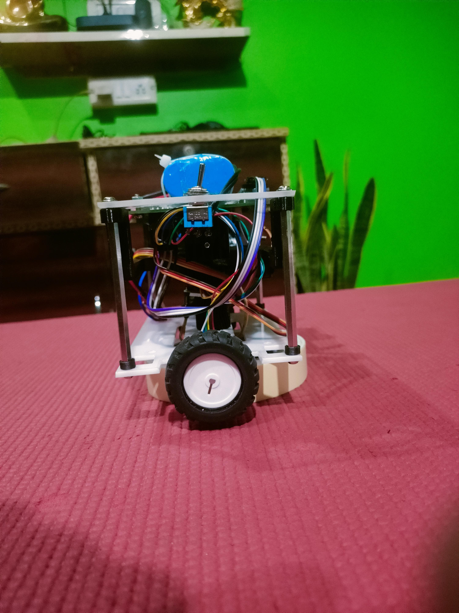

# Self-Balancing Robot with Gripper

This project involves building and programming a self-balancing two-wheeled robot that uses **PID control and an MPU6050 IMU** to maintain upright stability. The real-world robot includes a **servo-operated gripper** and was also simulated in **CoppeliaSim** to perform navigation and object manipulation tasks.

---

## 📌 Project Objectives

- Develop a real-time **balancing controller** using MPU6050 IMU data.
- Implement a **PID control algorithm** on Arduino for dynamic motor control.
- Integrate and test a **servo-controlled gripper** (partially functional).
- Extend control logic to a **simulated robot in CoppeliaSim**, performing tasks such as balancing, movement, and object pickup.

---

## 🧠 Technical Concepts

- **PID Control**: Real-time error correction using tuned Kp, Ki, and Kd values.
- **Sensor Fusion**: MPU6050 IMU provides pitch data for control logic.
- **Embedded Motor Control**: Uses H-bridge with PWM for direction/speed control.
- **Simulation with CoppeliaSim**: Logic transferred to virtual environment using provided robot model.

---

## 🔧 Hardware Used

- Arduino Nano
- MPU6050 Gyroscope/Accelerometer
- 2x Geared DC Motors + Motor Driver (L298N or similar)
- 2x Servo Motors (for gripper)
- 1x 3D-Printed/Custom Robot Frame
- Battery Pack
- Jumper Wires

---

## 💻 Software Used

- Arduino IDE
- MPU6050_light Library
- CoppeliaSim (V-REP) for simulation
- Serial Monitor for tuning and debugging

---

## 🚦 Real-World Results

- Bot balances upright for **2–3 minutes** on rougher surfaces.
- Can tolerate small disturbances; fails on smooth floors due to low traction.
- Gripper mechanism was **mechanically installed and tested**, but not integrated fully due to software conflicts.
- **PID tuning was done manually**, observing live angle/PID values via Serial Monitor.

---

## 🧪 Simulation Results (CoppeliaSim)

- Task robot (provided by e-Yantra IIT Bombay) was programmed to:
  - Balance on two wheels using logic adapted from Arduino code
  - Navigate in the environment
  - Use **virtual gripper** to pick and place nearby blocks
- All virtual tasks successfully demonstrated in simulation environment

---

## 📂 Project Structure

self-balancing-robot/
│
├── ArduinoCode/
│ ├── main_balancer.ino # Full PID and motor control logic
│ ├── gripper_test.ino # Partial test code for servo gripper
│
├── simulation/
│ ├── coppeliasim_task.ttt # Simulation scene (placeholder)
│
├── images/
│ ├── front_view.jpg
│ ├── side_view.jpg
│ ├── internal_wiring.jpg
│
├── videos/
│ ├── real_demo.mp4 # Real robot balancing demo
│ ├── sim_demo.mp4 # CoppeliaSim simulation demo
│
└── README.md # This file

---

## 📸 Media

- 
- 
- 📹 [Real-world balancing demo](videos/real_demo.mp4)
- 📹 [CoppeliaSim simulation demo](videos/sim_demo.mp4)

---

## 🤖 Credits

- Simulation task model provided by **e-Yantra IIT Bombay** (competition).
- I was primarily responsible for:
  - Coding PID balancing logic on Arduino
  - Integrating MPU6050 sensor readings
  - Motor and gripper control (hardware + software)

---

## 🚀 Future Improvements

- Improve balancing duration using better motors and PID tuning
- Fully integrate servo gripper in real-world robot
- Add remote control or autonomy for navigation

